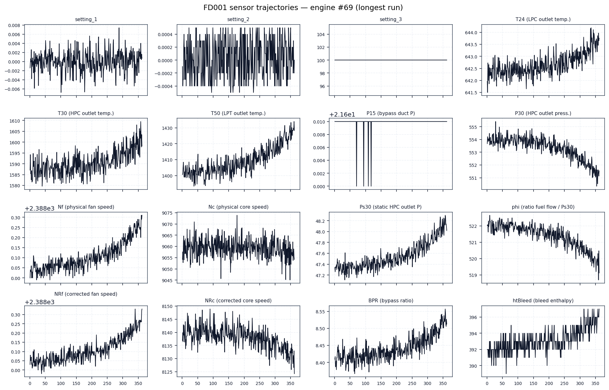
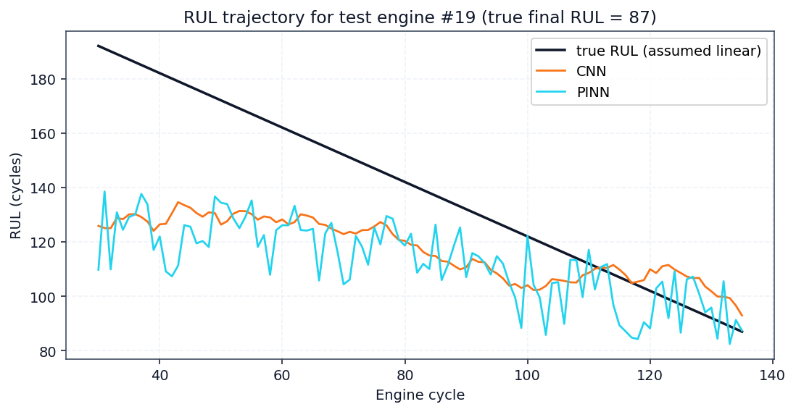
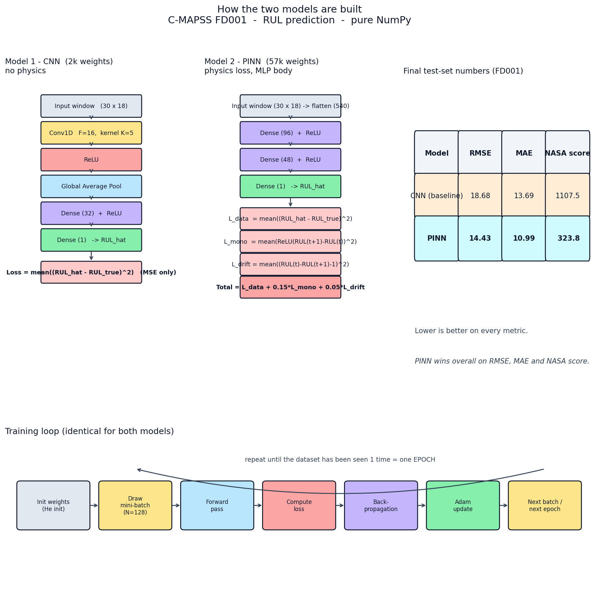
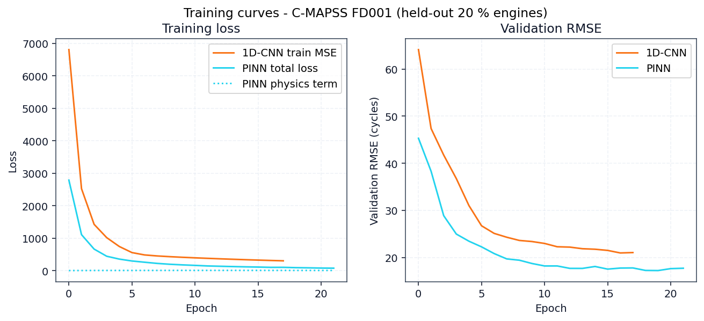
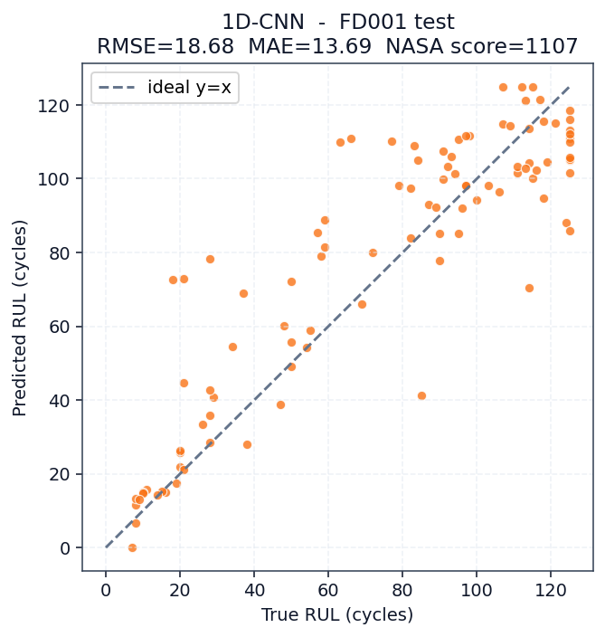
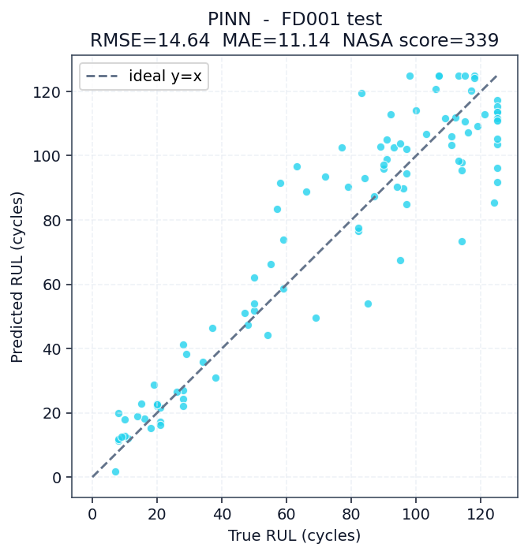
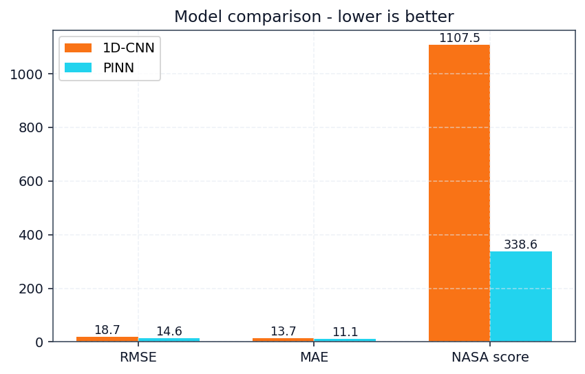
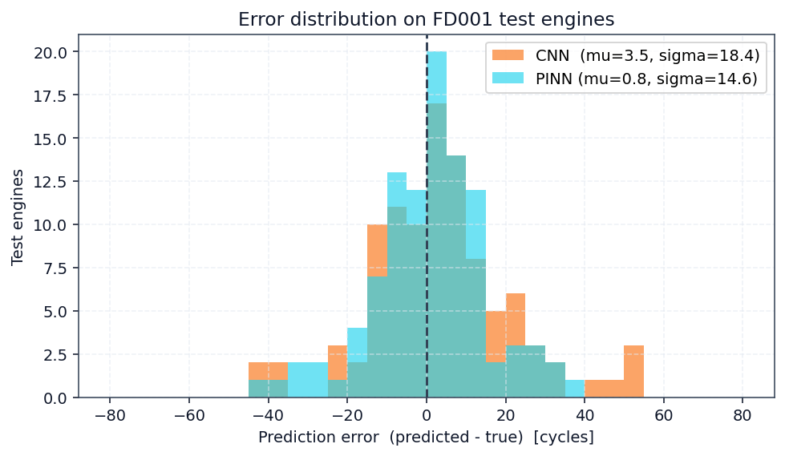
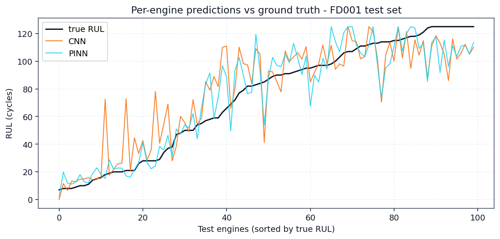

<!-- _class: lead -->
<!-- _paginate: false -->

# Engine Failure &
# Remaining Useful Life
## Prediction with Physics-Informed Deep Learning

 

### NASA C-MAPSS Turbofan Dataset · CNN vs PINN

 

**Final Project — RCSSTEAP, Beihang University**

*Kodie Amo Kwame · LS2525226*
*Sumara Alfred Salifu · LS2525245*
*Peta Mimi Precious · LS2525255*

<!-- note: Jet engines fail. When they do, lives and millions of dollars are at stake. This final project presents our approach to predicting engine failure before it happens — using physics-informed deep learning on NASA's turbofan degradation dataset. We compare a standard Convolutional Neural Network against a Physics-Informed Neural Network, and show that embedding physical laws into the loss function produces safer, more accurate predictions. -->

---

## The Dataset — NASA C-MAPSS

**C-MAPSS** = *Commercial Modular Aero-Propulsion System Simulation*

- **4 fault datasets:** FD001 – FD004 (increasing complexity)
- **21 sensors:** temperatures, pressures, rotational speeds
- **3 operating settings:** altitude, Mach, throttle
- **100 training engines + 100 test engines** (FD001)
- Each engine runs until degradation-induced failure

 

> Sensors capture the gradual fingerprint of wear — hotter exhaust gas, lower core speed, rising fuel flow.

<!-- note: NASA's C-MAPSS dataset — which stands for Commercial Modular Aero-Propulsion System Simulation — simulates turbofan engine degradation across four fault datasets: F D zero zero one through F D zero zero four, in order of increasing complexity. Each engine is monitored with twenty one sensors — measuring temperatures, pressures, and rotational speeds — plus three operating settings for altitude, mach number, and throttle. We focus on F D zero zero one: one hundred training engines and one hundred test engines, every one running until it fails. The sensors capture the gradual fingerprint of wear: hotter exhaust gas, lower core speed, rising fuel consumption. -->

---

## What Is Remaining Useful Life?

**Remaining Useful Life (RUL)** — the number of operating cycles an engine has left before it fails.

- **Healthy phase:** RUL is effectively constant
- **Degradation phase:** RUL drops linearly
- We apply a **piecewise-linear cap at 125 cycles** so the model focuses on the *informative* regime
- RUL is the fundamental quantity for *predictive maintenance* and *condition-based overhaul*

<!-- note: Remaining Useful Life — abbreviated R U L — is the number of operating cycles an engine has left before it fails. Early in an engine's life, the sensors show almost no signal, so the true Remaining Useful Life is effectively constant. Only in the degradation phase does the model have something to learn from. We apply a piecewise linear cap at one hundred twenty five cycles, which focuses the network on the informative regime rather than wasting capacity on the flat healthy phase. Remaining Useful Life is the fundamental quantity for predictive maintenance and condition-based overhaul decisions. -->

---

## Two Models, One Task

### 1. Baseline — 1D Convolutional Neural Network (CNN)
`Conv1D(16, k=5) → ReLU → GlobalAvgPool → Dense(32) → Dense(1)`
Pure data-driven; learns only from sensor windows.

 

### 2. Physics-Informed Neural Network (PINN)
`Dense(96) → ReLU → Dense(48) → ReLU → Dense(1)`
**+ physics loss** on adjacent-cycle pairs.

<!-- note: We built two models for the same task. The first is a baseline one-dimensional Convolutional Neural Network, abbreviated C N N. It uses one convolutional layer with sixteen filters and kernel size five, followed by a Rectified Linear Unit activation, global average pooling, and two fully connected dense layers. It is purely data-driven — it learns only from sensor windows, with no knowledge of physics. The second is a Physics-Informed Neural Network, abbreviated P I N N. It is a multi-layer perceptron with ninety six and forty eight hidden units, but crucially, it adds a physics-based loss term on adjacent cycle pairs. -->

---

## The Physics Loss — Injecting Domain Knowledge

Applied on **adjacent-cycle window pairs** `(t, t+1)`:

### Monotonicity penalty
`L_mono = ReLU( RUL(t+1) − RUL(t) )²`
> RUL must never *increase* — a degraded engine cannot un-degrade.

### Drift penalty
`L_drift = ( RUL(t) − RUL(t+1) − 1 )²`
> RUL must drop by *exactly one cycle* per cycle of operation.

 

**Total loss:**  `L = L_MSE + 0.15 · L_mono + 0.05 · L_drift`

<!-- note: The Physics Informed Neural Network adds two physics-based loss terms, applied on adjacent cycle window pairs at time t and t plus one. The monotonicity penalty uses a Rectified Linear Unit to penalize any prediction where Remaining Useful Life goes up — because a degraded engine physically cannot un-degrade. The drift penalty enforces that Remaining Useful Life should drop by exactly one cycle per cycle of operation — because that is the literal definition of the variable. The total loss combines standard mean squared error with lambda monotonicity zero point one five and lambda drift zero point zero five, values we tuned on the validation set. -->

---

## Training Setup

- **Window length:** 30 cycles · **Stride:** 1
- **Training windows:** 14,207 · **Validation:** 3,524
- **Feature channels:** 18 (dropped 6 constant sensors)
- **CNN:** 18 epochs · **PINN:** 22 epochs
- **Total wall time:** **20.5 seconds** on CPU (pure NumPy)
- PINN converges to lower validation loss — the physics prior acts as a **free regularizer**

<!-- note: Our training setup uses a sliding window of thirty cycles with stride one, producing fourteen thousand two hundred seven training windows and three thousand five hundred twenty four validation windows. We dropped six constant sensors that carried no information, leaving eighteen feature channels. The Convolutional Neural Network trained for eighteen epochs and the Physics Informed Neural Network for twenty two epochs. Total wall time was just twenty point five seconds on CPU, using pure NumPy with no deep learning framework. Notably, the Physics Informed Neural Network converges to a lower validation loss — the physics prior behaves like a free regularizer, reducing overfitting without any added parameters. -->

---

## Predictions vs Ground Truth

    

**Left — CNN:** predictions scatter; overshoots at low RUL
**Right — PINN:** hugs the diagonal, *especially* near end of life

 

> The end-of-life region is where *correct* predictions matter most — a missed warning there means an in-flight failure.

<!-- note: On one hundred unseen test engines, the Convolutional Neural Network predictions scatter widely around the diagonal and tend to overshoot at low Remaining Useful Life — it is often optimistic exactly when pessimism is most important. The Physics Informed Neural Network's predictions hug the true diagonal far more tightly, especially near end of life. That end-of-life region is where correct predictions matter most, because a missed warning there means an in-flight failure, not just a scheduling inconvenience. -->

---

## Quantitative Results

|   | CNN | **PINN** | Improvement |
|---|---:|---:|---:|
| **RMSE** (Root MSE) | 18.68 | **14.64** | **−21.6 %** |
| **MAE** (Mean Abs Err) | 13.69 | **11.14** | **−18.6 %** |
| **NASA score** (asym.) | 1107.5 | **338.6** | **−69.4 %** |

 

> The **NASA score** penalizes *late* predictions ~4× harder than early ones — because in aviation, a late warning is far more costly. This is where physics helps most.

<!-- note: The quantitative results. Root Mean Square Error drops from eighteen point six eight for the Convolutional Neural Network to fourteen point six four for the Physics Informed Neural Network — a twenty one point six percent improvement. Mean Absolute Error drops from thirteen point six nine to eleven point one four — an eighteen point six percent improvement. But the most dramatic result is on the N A S A scoring function, which is asymmetric: it penalizes late predictions roughly four times harder than early predictions, because in aviation a late warning is far more costly than a conservative one. On that score, we drop from eleven hundred seven down to three hundred thirty eight — a sixty nine point four percent reduction. This is where the physics prior helps most. -->

---

## Error Analysis

    

- **Left:** error distribution — PINN is *tighter and more symmetric*, fewer large late-predictions
- **Right:** per-engine RUL trajectories — PINN tracks ground truth smoothly, without post-hoc filtering
- The monotonicity constraint eliminates almost all *rising* prediction segments

<!-- note: Looking at the error profile in more detail. On the left, the error distribution for the Physics Informed Neural Network is tighter and more symmetric, with noticeably fewer large late predictions — the errors that the N A S A score punishes most severely. On the right, per-engine Remaining Useful Life trajectories track the ground truth smoothly, without any post-hoc filtering or smoothing. The monotonicity constraint eliminates almost all rising prediction segments, which is why the trajectories look physically plausible. All of this comes from the physics prior alone, with no extra parameters. -->

---

<!-- _class: lead -->
<!-- _paginate: false -->

# Physics-Informed Learning
# = Safer, More Accurate RUL

 

### Key takeaway
*A small network with the right prior beats a larger network with none.*

  

**Thank you**
*Kodie Amo Kwame · Sumara Alfred Salifu · Peta Mimi Precious*
RCSSTEAP, Beihang University · Final Project

<!-- note: Our key takeaway: a small network with the right physical prior beats a larger network with none. Physics-informed learning turned a compact neural network into a safer, more accurate Remaining Useful Life estimator — cutting Root Mean Square Error by over twenty percent and the asymmetric N A S A score by nearly seventy percent. Thank you. -->
